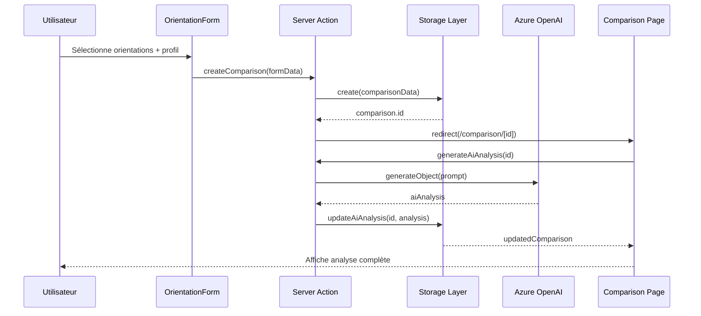
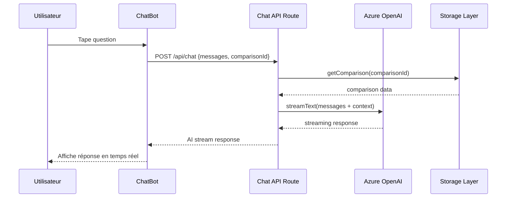

# 02. Architecture - Architecture technique détaillée

## 🏗️ Vue d'ensemble de l'architecture

L'application suit une architecture moderne basée sur Next.js 14 avec l'App Router, intégrant l'IA Azure OpenAI et un système de stockage en mémoire extensible.

```
┌─────────────────────────────────────────────────────────────┐
│                     FRONTEND (Next.js 14)                   │
├─────────────────┬─────────────────┬─────────────────────────┤
│   Components    │   App Router    │     Server Actions      │
│   (React/JSX)   │   (Pages)       │    (Business Logic)     │
└─────────────────┴─────────────────┴─────────────────────────┘
                              │
                              ▼
┌─────────────────────────────────────────────────────────────┐
│                      API LAYER                              │
├─────────────────────────────┬───────────────────────────────┤
│        Chat API             │       Server Actions API      │
│    (Streaming AI Chat)      │    (CRUD Operations)          │
└─────────────────────────────┴───────────────────────────────┘
                              │
                              ▼
┌─────────────────────────────────────────────────────────────┐
│                   BUSINESS LOGIC                            │
├─────────────────┬─────────────────┬─────────────────────────┤
│   AI Integration│  Data Models    │    Storage Layer        │
│  (Azure OpenAI) │  (Validation)   │   (In-Memory + DB)      │
└─────────────────┴─────────────────┴─────────────────────────┘
                              │
                              ▼
┌─────────────────────────────────────────────────────────────┐
│                  EXTERNAL SERVICES                          │
├─────────────────────────────┬───────────────────────────────┤
│      Azure OpenAI API       │       Static Data Files      │
│    (GPT-4o generateObject)  │    (Orientations, Gov.)       │
└─────────────────────────────┴───────────────────────────────┘
```

## 📁 Structure des Dossiers

```
src/
├── app/                          # App Router (Next.js 14)
│   ├── page.jsx                  # Page d'accueil
│   ├── layout.js                 # Layout principal
│   ├── globals.css               # Styles globaux
│   ├── comparison/
│   │   └── [id]/
│   │       └── page.jsx          # Page de comparaison dynamique
│   └── api/
│       └── chat/
│           └── route.js          # API route pour chat streaming
├── components/                   # Composants React réutilisables
│   ├── OrientationForm.jsx       # Formulaire de sélection
│   ├── ComparisonView.jsx        # Affichage de l'analyse IA
│   ├── ChatBot.jsx               # Interface de chat
│   └── LoadingSpinner.jsx        # Composant de chargement
├── actions/                      # Server Actions (Next.js)
│   ├── comparison-actions.js     # CRUD des comparaisons
│   └── ai-comparison.js          # Intégration IA
├── lib/                          # Utilitaires et configuration
│   ├── azure-ai.js              # Configuration Azure OpenAI
│   ├── orientations.js           # Utilitaires données orientations
│   ├── comparison-model.js       # Modèle de données
│   ├── comparison-storage.js     # Couche de stockage
│   └── prompts.js               # Templates de prompts IA
└── data/                        # Données statiques
    └── orientations.json         # Base de données orientations
```

## 🔄 Flux de Données

### 1. Flux de Création de Comparaison



### 2. Flux de Chat Assistant



## 🧩 Composants d'Architecture

### 1. Frontend Layer

**Next.js 14 App Router**
- **App Directory**: Structure basée sur le système de fichiers
- **Server Components**: Rendu côté serveur par défaut
- **Client Components**: Marqués avec 'use client' pour interactivité
- **Dynamic Routes**: `/comparison/[id]` pour chaque comparaison
- **Layouts**: Layout partagé avec navigation et styles

**React Components**
```jsx
// Hiérarchie des composants
App Layout
├── HomePage
│   └── OrientationForm (Client)
└── ComparisonPage
    ├── ComparisonView (Client)
    └── ChatBot (Client)
        └── LoadingSpinner
```

### 2. Server Actions Layer

**Avantages des Server Actions**
- **Type Safety**: Arguments typés automatiquement
- **Progressive Enhancement**: Fonctionne sans JavaScript
- **Security**: Exécution côté serveur sécurisée
- **Performance**: Pas de round-trip API classique

**Actions Principales**
```javascript
// comparison-actions.js
export async function createComparison(formData)
export async function generateAiAnalysis(comparisonId)
export async function getComparison(comparisonId)
export async function updateComparison(comparisonId, updateData)
export async function deleteComparison(comparisonId)

// ai-comparison.js
export async function generateComparison(orientation1, orientation2, userProfile)
export function validateComparisonInput(...)
export function enhanceAnalysis(...)
```

### 3. API Routes Layer

**Chat API Route** (`/api/chat/route.js`)
- **Streaming**: Réponses IA en temps réel
- **Context Injection**: Données de comparaison automatiquement ajoutées
- **Error Handling**: Gestion gracieuse des erreurs IA
- **Rate Limiting**: Protection contre les abus (à implémenter)

```javascript
export async function POST(request) {
  const { messages, comparisonId } = await request.json();
  const comparison = await getComparison(comparisonId);
  const context = createChatbotContext(comparison);
  
  const result = await streamText({
    model: openai('gpt-4o'),
    system: `${CHATBOT_SYSTEM_PROMPT}\n\n${context}`,
    messages,
  });
  
  return result.toAIStreamResponse();
}
```

### 4. Business Logic Layer

**AI Integration** (`ai-comparison.js`)
- **generateObject**: Génération structurée avec Zod schema
- **Prompt Engineering**: Templates optimisés pour le contexte tunisien
- **Fallback Logic**: Analyse de secours en cas d'échec IA
- **Enhancement**: Ajout d'insights basés sur les données utilisateur

**Data Models** (`comparison-model.js`)
```javascript
export class ComparisonModel {
  constructor({ orientation1, orientation2, userProfile, aiAnalysis });
  
  toJSON() // Sérialisation
  static fromJSON(data) // Désérialisation
  updateAiAnalysis(aiAnalysis) // Mise à jour
  isValid() // Validation
  getShareableUrl() // URL partage
}
```

### 5. Storage Layer

**In-Memory Storage** (`comparison-storage.js`)
- **Map-based**: Utilise Map JavaScript pour performance
- **Singleton Pattern**: Instance unique globale
- **CRUD Operations**: Create, Read, Update, Delete
- **Search & Analytics**: Fonctions de recherche et statistiques
- **Export/Import**: Sauvegarde et migration des données

```javascript
class ComparisonStorage {
  constructor() {
    this.comparisons = new Map();
  }
  
  async create(comparisonData)
  async getById(id)
  async update(id, updateData)
  async delete(id)
  async search(criteria)
  async getStats()
}
```

## 🔧 Configuration et Environment

### Variables d'Environnement

```bash
# .env.local
AZURE_OPENAI_API_KEY=your_azure_openai_key
AZURE_OPENAI_ENDPOINT=https://your-resource.openai.azure.com/
AZURE_OPENAI_API_VERSION=2024-02-15-preview
```

### Next.js Configuration

```javascript
// next.config.mjs
const nextConfig = {
  experimental: {
    serverActions: true,
  },
  env: {
    AZURE_OPENAI_API_KEY: process.env.AZURE_OPENAI_API_KEY,
  },
};
```

## 🚀 Performance et Optimisation

### 1. Optimisations Frontend
- **Code Splitting**: Composants chargés à la demande
- **Image Optimization**: Next.js Image component
- **CSS Optimization**: Tailwind CSS purging
- **Bundle Analysis**: webpack-bundle-analyzer

### 2. Optimisations Backend
- **Server Components**: Rendu côté serveur par défaut
- **Streaming**: Réponses IA progressives
- **Caching**: Mise en cache des analyses IA
- **Connection Pooling**: Réutilisation des connexions

### 3. Optimisations IA
- **Prompt Optimization**: Templates optimisés pour tokens
- **Response Caching**: Cache des réponses similaires
- **Fallback Strategy**: Analyses de secours rapides
- **Token Management**: Limitation du nombre de tokens

## 🔒 Sécurité

### 1. Authentification et Autorisation
```javascript
// Actuellement: Session-based (anonyme)
// Futur: JWT + NextAuth.js
const session = {
  id: nanoid(),
  createdAt: new Date(),
  comparisons: Set<string>
};
```

### 2. Validation des Données
```javascript
// Zod schemas pour validation
const UserProfileSchema = z.object({
  score: z.number().min(0).max(20),
  location: z.string().min(1),
  selectedAt: z.date()
});
```

### 3. Protection API
- **Rate Limiting**: À implémenter avec `@vercel/kv`
- **Input Sanitization**: Validation stricte des entrées
- **CORS Configuration**: Headers sécurisés
- **API Key Protection**: Variables d'environnement

## 📊 Monitoring et Observabilité

### 1. Logging
```javascript
// Structure de logs
{
  timestamp: Date.now(),
  level: 'info|warn|error',
  service: 'ai-comparison|chat-api|storage',
  message: 'Description',
  metadata: { userId, comparisonId, duration }
}
```

### 2. Métriques
- **Performance**: Temps de réponse IA, latence API
- **Usage**: Nombre de comparaisons, questions de chat
- **Erreurs**: Taux d'échec IA, erreurs de validation
- **Business**: Orientations populaires, scores moyens

### 3. Health Checks
```javascript
// /api/health endpoint
export async function GET() {
  return {
    status: 'healthy',
    timestamp: new Date().toISOString(),
    services: {
      storage: 'up',
      ai: await checkAzureOpenAI(),
      database: 'up' // futur
    }
  };
}
```

## 🔄 CI/CD et Deployment

### 1. Vercel Deployment
```javascript
// vercel.json
{
  "functions": {
    "src/app/api/chat/route.js": {
      "maxDuration": 30
    }
  },
  "env": {
    "AZURE_OPENAI_API_KEY": "@azure-openai-key"
  }
}
```

### 2. GitHub Actions (Futur)
```yaml
# .github/workflows/deploy.yml
name: Deploy
on:
  push:
    branches: [main]
jobs:
  deploy:
    runs-on: ubuntu-latest
    steps:
      - uses: actions/checkout@v2
      - uses: vercel/action@v25
```

---

**Section précédente**: [01. Overview](./01-overview.md)  
**Prochaine section**: [03. AI Integration](./03-ai-integration.md)
